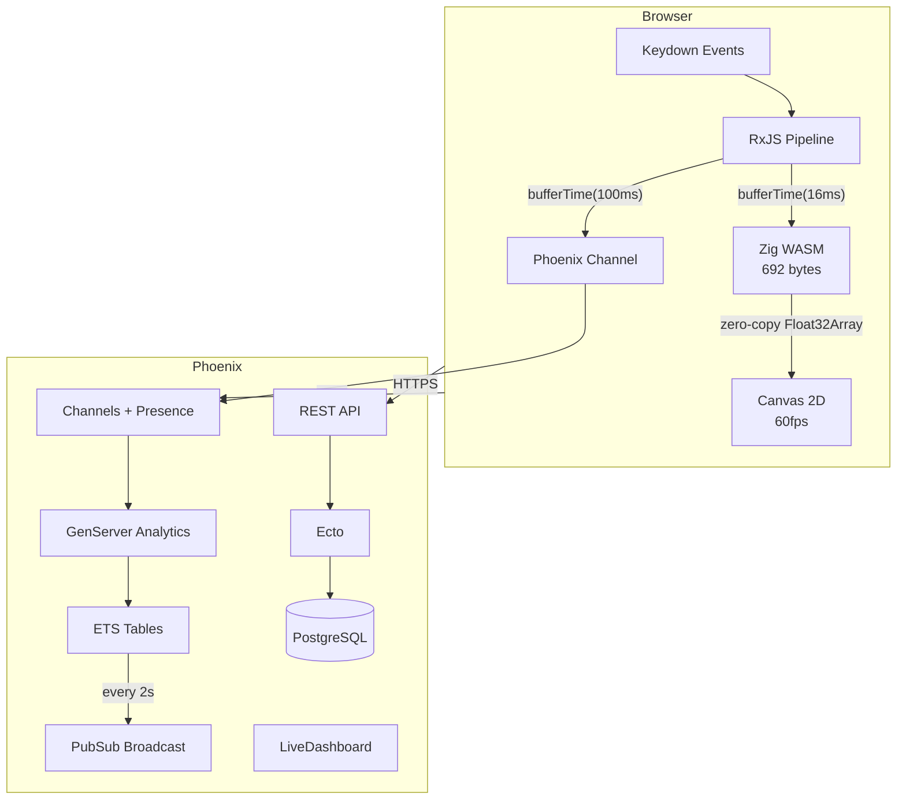

<div align="center">

# ChronoType

**Real-time keystroke dynamics visualizer**

[](https://ziglang.org)
[](https://elixir-lang.org)
[](https://typescriptlang.org)
[](https://webassembly.org)
[](#testing)
[](#license)

Captures keystroke timing, computes running statistics in Zig-compiled WASM,
and renders live-updating visualizations via RxJS-coordinated canvas operations.
Streams to an Elixir/Phoenix backend for real-time multi-user analytics.

</div>

---

## What is this?

ChronoType is a browser-based instrument that measures how you type. Every keystroke's timing feeds into a 692-byte Zig WASM module running Welford's online algorithm, producing real-time mean, variance, and histogram data with zero garbage collection pauses. Eight different canvas visualizations render this data at 60fps, from EKG waveforms to Matrix-style memory views. An Elixir/Phoenix backend handles multi-user streaming, leaderboards, and analytics via OTP GenServers and Phoenix Channels.

Built as a developer portfolio piece demonstrating sub-frame temporal consistency between input events, statistical computation, and pixel output.

---

## Gallery

Eight visualizations, one engine. Each renders the same WASM data through a different lens.

| # | Visualization | Motion | What it shows |
|---|---|---|---|
| 1 | **The Pipeline** | Mechanical | Data flow schematic with glowing packets and spinning gears |
| 2 | **The Histogram** | Organic | Spring-physics bars with particle splash and gaussian overlay |
| 3 | **The Waveform** | Organic | EKG heartbeat with triple-pass glow and stddev ribbon |
| 4 | **The Memory** | Data Matrix | WASM hex grid with Matrix rain and byte-diff flash |
| 5 | **The Scatter** | Organic + Data | Particle cloud with outlier rings and density bloom |
| 6 | **The Heatmap** | Mechanical | LED spectrogram with amber-to-white color ramp |
| 7 | **The Streams** | Data + Mech | RxJS marble diagram with color-coded operator tracks |
| 8 | **The Stats** | All three | Odometer digits, sparklines, and radar typing fingerprint |

Navigate via `/gallery` or arrow keys between pages. Each visualization includes a "Try it live" toggle.

---

## Architecture



---

## The Moat

Why Zig compiled to WASM for a statistics engine?

JavaScript's garbage collector introduces unpredictable pauses during continuous typing. For a real-time visualizer running at 60fps, even a 2ms GC pause drops frames. Zig compiles to a **692-byte** WASM module that:

- Runs Welford's online algorithm in **O(1)** per keystroke with **constant memory** (137 bytes used)
- Shares memory with JavaScript via **zero-copy** `Float32Array` views (no serialization)
- Computes mean, variance, standard deviation, and 20-bin histogram without storing historical data
- Uses `f64` internally for numerical stability, exports `f32` for ABI simplicity
- Has **zero runtime dependencies** and no GC

The result: flat memory heap during hour-long typing sessions, no dropped frames, and statistics that converge as typing rhythm stabilizes.

---

## Tech Stack

| Layer | Technology | Role |
|---|---|---|
| Compute | Zig 0.15.2 -> WASM | Welford's algorithm, histogram bins, zero-copy shared memory |
| Streams | RxJS 7.x | Reactive pipeline: keydown -> buffer -> WASM -> canvas |
| Render | Canvas 2D | 60fps visualization, 8 different renderers |
| Frontend | RedwoodJS 8.9.0 | React SPA shell, routing, Vite build |
| Backend | Elixir / Phoenix 1.8 | REST API, Channels, Presence, GenServer analytics, LiveDashboard |
| Database | PostgreSQL | Session persistence, leaderboards, analytics snapshots |
| Deploy | Railway | 2 services: Phoenix (serves SPA) + Postgres |

---

## Quick Start

### Prerequisites

- [Zig](https://ziglang.org/download/) 0.15.x
- [Elixir](https://elixir-lang.org/install.html) 1.19+ / OTP 28
- [Node.js](https://nodejs.org/) 20+
- [Docker](https://docker.com) (for Postgres)

### Run

```bash
git clone https://github.com/s3nik/chrono-type.git
cd chrono-type

# Start Postgres
docker compose up -d postgres

# Start everything (builds WASM, starts Phoenix + RedwoodJS)
./scripts/dev.sh
```

| URL | What |
|---|---|
| `http://localhost:8910` | App (Home) |
| `http://localhost:8910/session` | Typing session |
| `http://localhost:8910/gallery` | Visualization gallery |
| `http://localhost:4000/dashboard` | Phoenix LiveDashboard |

---

## Project Structure

```
chrono-type/
  zig/                          # Zig WASM statistics engine
    src/stats.zig               #   Welford's algorithm + histogram (692 bytes)
    build.zig                   #   wasm32-freestanding target

  redwood/                      # RedwoodJS frontend (SPA)
    web/src/
      lib/
        wasm/                   #   WASM loader + TypeScript bindings
        streams/                #   RxJS keystroke pipeline (3 streams)
        canvas/                 #   Histogram renderer (Stripe aesthetic)
        gallery/                #   Gallery infrastructure
          renderers/            #   8 visualization renderers (~3,000 LOC)
        phoenix/                #   Socket manager + REST client
      pages/                    #   Home, Session, Gallery, 8 viz pages
      components/               #   TypingArea, GalleryShell, etc.

  phoenix/                      # Elixir/Phoenix backend
    lib/chrono_type/
      accounts/                 #   User auth (bcrypt)
      typing/                   #   Sessions, keystrokes, passages
      analytics/                #   GenServer pipeline + ETS
    lib/chrono_type_web/
      channels/                 #   Typing + Lobby channels, Presence
      controllers/              #   Auth, Session, Stats, Health

  scripts/
    dev.sh                      # Start all services
    build-wasm.sh               # Compile Zig -> WASM
  docker-compose.yml            # Postgres for local dev
  railway.toml                  # Railway deployment config
```

---

## Testing

Three test suites across three languages:

```bash
# Zig — Welford's algorithm + histogram (11 tests)
cd zig && zig build test

# TypeScript — WASM bridge, Canvas, RxJS, gallery (61 tests)
cd redwood/web && npx vitest run

# Elixir — Accounts, Typing, Analytics, Channels (16 tests)
cd phoenix && mix test
```

---

## Deployment

ChronoType deploys to Railway as 2 services from one repo.

The multi-stage Dockerfile builds all three stacks:
1. **Zig stage** — compiles WASM binary
2. **Node stage** — builds RedwoodJS web
3. **Elixir stage** — compiles Phoenix release with SPA in `priv/static/`
4. **Runtime** — Alpine 3.20, serves everything from one container

```bash
# Railway deployment
railway up
```

Environment variables: `DATABASE_URL`, `SECRET_KEY_BASE`, `PHX_HOST`, `PORT`

---

## Key Numbers

| Metric | Value |
|---|---|
| WASM binary | 692 bytes |
| Tests passing | 77 (11 Zig + 61 TS + 16 Elixir) |
| Gallery visualizations | 8 |
| Canvas renderer LOC | ~3,000 |
| Commits | 39 |
| Lighthouse Accessibility | 100 |
| Lighthouse Best Practices | 100 |
| LCP | 269ms |
| INP | 41ms |

---

## License

MIT
