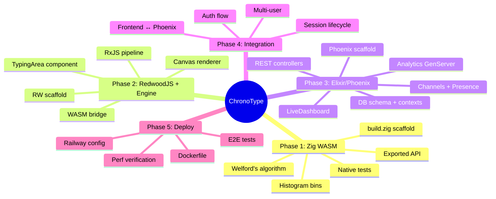

# ChronoType Implementation Plan

> **For agentic workers:** REQUIRED SUB-SKILL: Use superpowers:subagent-driven-development (recommended) or superpowers:executing-plans to implement this plan task-by-task. Steps use checkbox (`- [ ]`) syntax for tracking.

**Goal:** Build a real-time keystroke dynamics visualizer that demonstrates Zig/WASM, RxJS, RedwoodJS, and Elixir/Phoenix as a developer portfolio showcase.

**Architecture:** Elixir-Primary (Approach C). Phoenix owns all server concerns (auth, REST API, Channels, Presence, GenServer analytics, LiveDashboard). RedwoodJS is the SPA frontend shell. Zig→WASM is the computational moat. Phoenix serves the SPA in production. Deploy to Railway (2 services: Phoenix + Postgres).

**Tech Stack:** Zig 0.15.2 → WASM, RxJS 7.x, Canvas 2D, RedwoodJS 8.9.0 (React), Elixir 1.19.5 / Phoenix 1.8.x, PostgreSQL, Railway

**Spec:** `docs/superpowers/specs/2026-03-29-chronotype-design.md`

---



---

## Phase 1: Zig WASM Statistics Engine (Tasks 1-6)

### Task 1: Scaffold Zig Project Structure

**Files:**
- Create: `zig/build.zig.zon`
- Create: `zig/build.zig`
- Create: `zig/src/stats.zig` (minimal stub)

- [ ] **Step 1: Create directories**

```bash
mkdir -p /Users/s3nik/Desktop/chrono-type/zig/src
mkdir -p /Users/s3nik/Desktop/chrono-type/scripts
```

- [ ] **Step 2: Create build.zig.zon**

```zig
// zig/build.zig.zon
.{
    .name = .chrono_stats,
    .version = "0.1.0",
    .fingerprint = 0xc47a3b2e9f1d5a08,
    .minimum_zig_version = "0.15.2",
    .dependencies = .{},
    .paths = .{
        "build.zig",
        "build.zig.zon",
        "src",
    },
}
```

- [ ] **Step 3: Create build.zig**

```zig
// zig/build.zig
const std = @import("std");

pub fn build(b: *std.Build) void {
    const optimize = b.standardOptimizeOption(.{});

    // WASM library target
    const wasm = b.addExecutable(.{
        .name = "chrono_stats",
        .root_module = b.createModule(.{
            .root_source_file = b.path("src/stats.zig"),
            .target = b.resolveTargetQuery(.{
                .cpu_arch = .wasm32,
                .os_tag = .freestanding,
            }),
            .optimize = optimize,
        }),
    });
    wasm.entry = .disabled;
    wasm.rdynamic = true;
    b.installArtifact(wasm);

    // Native test target
    const test_step = b.step("test", "Run unit tests");
    const tests = b.addTest(.{
        .root_module = b.createModule(.{
            .root_source_file = b.path("src/stats.zig"),
            .target = b.host(),
            .optimize = optimize,
        }),
    });
    const run_tests = b.addRunArtifact(tests);
    test_step.dependOn(&run_tests.step);
}
```

- [ ] **Step 4: Create minimal stats.zig stub**

```zig
// zig/src/stats.zig
export fn update(_delta_ms: f32) void {}
```

- [ ] **Step 5: Verify build compiles**

```bash
cd /Users/s3nik/Desktop/chrono-type/zig && zig build
# Expected: no errors, produces zig-out/bin/chrono_stats.wasm
ls -la zig-out/bin/chrono_stats.wasm
```

- [ ] **Step 6: Commit**

```bash
git add zig/
git commit -m "feat: scaffold Zig WASM project with build.zig for wasm32-freestanding"
```

---

### Task 2: Implement Welford's Algorithm with Tests

**Files:**
- Modify: `zig/src/stats.zig`

- [ ] **Step 1: Write the test (add to stats.zig)**

```zig
// zig/src/stats.zig
const std = @import("std");
const testing = std.testing;

// --- Module State ---
var n: u32 = 0;
var mean: f64 = 0.0;
var m2: f64 = 0.0;
var min_val: f64 = std.math.inf(f64);
var max_val: f64 = -std.math.inf(f64);

// --- Welford's Online Algorithm ---
export fn update(delta_ms: f32) void {
    const delta: f64 = @floatCast(delta_ms);
    if (delta < 0) return; // ignore negative deltas

    n += 1;
    const d1 = delta - mean;
    mean += d1 / @as(f64, @floatFromInt(n));
    const d2 = delta - mean;
    m2 += d1 * d2;

    if (delta < min_val) min_val = delta;
    if (delta > max_val) max_val = delta;
}

export fn get_mean() f32 {
    return @floatCast(mean);
}

export fn get_variance() f32 {
    if (n < 2) return 0.0;
    return @floatCast(m2 / @as(f64, @floatFromInt(n - 1)));
}

export fn get_stddev() f32 {
    if (n < 2) return 0.0;
    const variance = m2 / @as(f64, @floatFromInt(n - 1));
    return @floatCast(@sqrt(variance));
}

export fn get_count() u32 {
    return n;
}

export fn reset() void {
    n = 0;
    mean = 0.0;
    m2 = 0.0;
    min_val = std.math.inf(f64);
    max_val = -std.math.inf(f64);
}

// --- Tests ---
test "welford: single value has zero variance" {
    reset();
    update(100.0);
    try testing.expectEqual(@as(u32, 1), get_count());
    try testing.expectApproxEqAbs(@as(f32, 100.0), get_mean(), 0.001);
    try testing.expectApproxEqAbs(@as(f32, 0.0), get_variance(), 0.001);
    try testing.expectApproxEqAbs(@as(f32, 0.0), get_stddev(), 0.001);
}

test "welford: two identical values have zero variance" {
    reset();
    update(50.0);
    update(50.0);
    try testing.expectEqual(@as(u32, 2), get_count());
    try testing.expectApproxEqAbs(@as(f32, 50.0), get_mean(), 0.001);
    try testing.expectApproxEqAbs(@as(f32, 0.0), get_variance(), 0.001);
}

test "welford: known values produce correct mean and variance" {
    reset();
    // Values: 10, 20, 30 -> mean=20, variance=100
    update(10.0);
    update(20.0);
    update(30.0);
    try testing.expectEqual(@as(u32, 3), get_count());
    try testing.expectApproxEqAbs(@as(f32, 20.0), get_mean(), 0.001);
    try testing.expectApproxEqAbs(@as(f32, 100.0), get_variance(), 0.1);
    try testing.expectApproxEqAbs(@as(f32, 10.0), get_stddev(), 0.1);
}

test "welford: negative delta ignored" {
    reset();
    update(50.0);
    update(-10.0);
    try testing.expectEqual(@as(u32, 1), get_count());
}

test "welford: reset clears state" {
    reset();
    update(100.0);
    update(200.0);
    reset();
    try testing.expectEqual(@as(u32, 0), get_count());
    try testing.expectApproxEqAbs(@as(f32, 0.0), get_mean(), 0.001);
}
```

- [ ] **Step 2: Run tests**

```bash
cd /Users/s3nik/Desktop/chrono-type/zig && zig build test
# Expected: All 5 tests pass
```

- [ ] **Step 3: Verify WASM still builds**

```bash
cd /Users/s3nik/Desktop/chrono-type/zig && zig build -Doptimize=ReleaseSmall
wc -c < zig-out/bin/chrono_stats.wasm
# Expected: < 2048 bytes
```

- [ ] **Step 4: Commit**

```bash
git add zig/src/stats.zig
git commit -m "feat: implement Welford's online algorithm with tests"
```

---

### Task 3: Add Histogram Binning

**Files:**
- Modify: `zig/src/stats.zig`

- [ ] **Step 1: Add histogram state and update logic**

Add to `zig/src/stats.zig` after the existing module state:

```zig
// --- Histogram (20 bins, 0-200ms, 10ms each) ---
const HIST_BINS: usize = 20;
const BIN_WIDTH: f64 = 10.0;
var histogram: [HIST_BINS]u32 = [_]u32{0} ** HIST_BINS;
var overflow_flag: u8 = 0;
```

Update the `update` function to also bin the value:

```zig
export fn update(delta_ms: f32) void {
    const delta: f64 = @floatCast(delta_ms);
    if (delta < 0) return;

    n += 1;
    const d1 = delta - mean;
    mean += d1 / @as(f64, @floatFromInt(n));
    const d2 = delta - mean;
    m2 += d1 * d2;

    if (delta < min_val) min_val = delta;
    if (delta > max_val) max_val = delta;

    // Histogram binning
    const bin_index: usize = @intFromFloat(@min(@max(delta / BIN_WIDTH, 0.0), @as(f64, HIST_BINS - 1)));
    histogram[bin_index] += 1;
}

export fn get_histogram_ptr() [*]u32 {
    return &histogram;
}

export fn get_overflow() u8 {
    return overflow_flag;
}
```

Update `reset` to also clear histogram:

```zig
export fn reset() void {
    n = 0;
    mean = 0.0;
    m2 = 0.0;
    min_val = std.math.inf(f64);
    max_val = -std.math.inf(f64);
    histogram = [_]u32{0} ** HIST_BINS;
    overflow_flag = 0;
}
```

- [ ] **Step 2: Add histogram tests**

```zig
test "histogram: value 55ms goes into bin 5" {
    reset();
    update(55.0);
    const hist_ptr = get_histogram_ptr();
    try testing.expectEqual(@as(u32, 1), hist_ptr[5]);
    try testing.expectEqual(@as(u32, 0), hist_ptr[0]);
    try testing.expectEqual(@as(u32, 0), hist_ptr[4]);
}

test "histogram: value 0ms goes into bin 0" {
    reset();
    update(0.0);
    const hist_ptr = get_histogram_ptr();
    try testing.expectEqual(@as(u32, 1), hist_ptr[0]);
}

test "histogram: value 199ms goes into bin 19" {
    reset();
    update(199.0);
    const hist_ptr = get_histogram_ptr();
    try testing.expectEqual(@as(u32, 1), hist_ptr[19]);
}

test "histogram: value 999ms clamps to bin 19" {
    reset();
    update(999.0);
    const hist_ptr = get_histogram_ptr();
    try testing.expectEqual(@as(u32, 1), hist_ptr[19]);
}

test "histogram: multiple values distribute correctly" {
    reset();
    update(15.0); // bin 1
    update(15.0); // bin 1
    update(85.0); // bin 8
    const hist_ptr = get_histogram_ptr();
    try testing.expectEqual(@as(u32, 2), hist_ptr[1]);
    try testing.expectEqual(@as(u32, 1), hist_ptr[8]);
}

test "histogram: reset clears bins" {
    reset();
    update(50.0);
    reset();
    const hist_ptr = get_histogram_ptr();
    try testing.expectEqual(@as(u32, 0), hist_ptr[5]);
}
```

- [ ] **Step 3: Run all tests**

```bash
cd /Users/s3nik/Desktop/chrono-type/zig && zig build test
# Expected: All 11 tests pass
```

- [ ] **Step 4: Commit**

```bash
git add zig/src/stats.zig
git commit -m "feat: add histogram binning (20 bins, 0-200ms)"
```

---

### Task 4: Add Build Script

**Files:**
- Create: `scripts/build-wasm.sh`

- [ ] **Step 1: Create the build script**

```bash
#!/bin/bash
set -euo pipefail

cd "$(dirname "$0")/../zig"

echo "Building Zig WASM..."
zig build -Doptimize=ReleaseSmall

WASM_FILE="zig-out/bin/chrono_stats.wasm"
SIZE=$(wc -c < "$WASM_FILE")
echo "Output: $WASM_FILE ($SIZE bytes)"

# Copy to RedwoodJS public if it exists
TARGET="../redwood/web/public/chrono_stats.wasm"
if [ -d "../redwood/web/public" ]; then
    cp "$WASM_FILE" "$TARGET"
    echo "Copied to $TARGET"
fi
```

- [ ] **Step 2: Make executable and test**

```bash
chmod +x /Users/s3nik/Desktop/chrono-type/scripts/build-wasm.sh
/Users/s3nik/Desktop/chrono-type/scripts/build-wasm.sh
# Expected: "Building Zig WASM..." then size < 2048 bytes
```

- [ ] **Step 3: Commit**

```bash
git add scripts/build-wasm.sh
git commit -m "feat: add WASM build script"
```

---

### Task 5: Initialize Git Repository

**Files:**
- Create: `.gitignore`

- [ ] **Step 1: Init git and create .gitignore**

```bash
cd /Users/s3nik/Desktop/chrono-type
git init
```

Create `.gitignore`:

```
# Zig
zig/zig-out/
zig/zig-cache/
zig/.zig-cache/

# Node
node_modules/
.yarn/cache
.yarn/install-state.gz

# RedwoodJS
redwood/.redwood/
redwood/web/dist/
redwood/api/dist/

# Elixir
phoenix/_build/
phoenix/deps/
phoenix/.elixir_ls/

# IDE
.idea/
.vscode/
*.swp

# Environment
.env
.env.local

# Superpowers
.superpowers/

# OS
.DS_Store
```

- [ ] **Step 2: Initial commit**

```bash
git add .
git commit -m "feat: ChronoType project init with Zig WASM engine

Zig statistics engine with Welford's online algorithm and histogram binning.
Compiles to <2KB WASM. All tests passing."
```

---

### Task 6: Run Full Zig Test Suite and Verify WASM Size

- [ ] **Step 1: Run all tests**

```bash
cd /Users/s3nik/Desktop/chrono-type/zig && zig build test
# Expected: All 11 tests pass
```

- [ ] **Step 2: Build release and check size**

```bash
cd /Users/s3nik/Desktop/chrono-type/zig && zig build -Doptimize=ReleaseSmall
wc -c < zig-out/bin/chrono_stats.wasm
# Expected: < 2048 bytes
```

- [ ] **Step 3: Verify exports**

```bash
# If wasmtime or wasm-tools is available:
wasm-tools print zig-out/bin/chrono_stats.wasm 2>/dev/null | head -20 || echo "wasm-tools not installed, skip"
```

Phase 1 complete. Checkpoint: verify all 11 Zig tests pass and WASM < 2KB.

---

## Phase 2: RedwoodJS Scaffold + TypeScript Engine (Tasks 7-30)

### Task 7: Create RedwoodJS App Scaffold

**Files:**
- Create: `redwood/` (entire scaffold)

- [ ] **Step 1: Create RedwoodJS app**

```bash
cd /Users/s3nik/Desktop/chrono-type
npx create-redwood-app@8.9.0 redwood --typescript --git-init=false --yes
```

- [ ] **Step 2: Verify scaffold**

```bash
ls redwood/web/src/App.tsx redwood/web/vite.config.ts redwood/redwood.toml
```

- [ ] **Step 3: Commit**

```bash
git add redwood/
git commit -m "chore: scaffold RedwoodJS 8.9.0 app"
```

---

### Task 8: Install Engine Dependencies

- [ ] **Step 1: Install rxjs and vitest**

```bash
cd /Users/s3nik/Desktop/chrono-type/redwood
yarn workspace web add rxjs@7.8.2
yarn workspace web add -D vitest@^2.0.0 jsdom@^25.0.0
```

- [ ] **Step 2: Commit**

```bash
git add redwood/
git commit -m "chore: install rxjs and vitest in web workspace"
```

---

### Task 9: Configure Vitest for Engine Tests

**Files:**
- Create: `redwood/web/vitest.config.ts`

- [ ] **Step 1: Create vitest config**

```typescript
// redwood/web/vitest.config.ts
import { defineConfig } from 'vitest/config'
import path from 'path'

export default defineConfig({
  test: {
    environment: 'jsdom',
    include: ['src/lib/**/*.test.ts'],
    globals: true,
  },
  resolve: {
    alias: {
      src: path.resolve(__dirname, 'src'),
    },
  },
})
```

- [ ] **Step 2: Verify**

```bash
cd /Users/s3nik/Desktop/chrono-type/redwood/web && npx vitest run --passWithNoTests
# Expected: passes with no tests
```

- [ ] **Step 3: Commit**

```bash
git add redwood/web/vitest.config.ts
git commit -m "chore: configure vitest for engine module tests"
```

---

### Task 10: Copy WASM Binary to Public Directory

- [ ] **Step 1: Copy WASM**

```bash
mkdir -p /Users/s3nik/Desktop/chrono-type/redwood/web/public
cp /Users/s3nik/Desktop/chrono-type/zig/zig-out/bin/chrono_stats.wasm \
   /Users/s3nik/Desktop/chrono-type/redwood/web/public/chrono_stats.wasm
```

- [ ] **Step 2: Commit**

```bash
git add redwood/web/public/chrono_stats.wasm
git commit -m "chore: add WASM binary to web public directory"
```

---

### Task 11: WASM Bridge Types — Write Test Then Implement

**Files:**
- Create: `redwood/web/src/lib/wasm/stats.ts`
- Create: `redwood/web/src/lib/wasm/stats.test.ts`

- [ ] **Step 1: Write failing test**

```typescript
// redwood/web/src/lib/wasm/stats.test.ts
import { describe, it, expect } from 'vitest'
import type { ChronoStatsExports, ChronoStatsApi } from './stats'
import { HISTOGRAM_BIN_COUNT, HISTOGRAM_BIN_WIDTH_MS } from './stats'

describe('ChronoStatsExports type', () => {
  it('defines expected WASM export signatures', () => {
    const mock: ChronoStatsExports = {
      memory: new WebAssembly.Memory({ initial: 1 }),
      update: (_: number) => {},
      get_mean: () => 0,
      get_variance: () => 0,
      get_stddev: () => 0,
      get_count: () => 0,
      get_histogram_ptr: () => 0,
      get_overflow: () => 0,
      reset: () => {},
    }
    expect(mock.memory).toBeInstanceOf(WebAssembly.Memory)
    expect(typeof mock.update).toBe('function')
  })
})

describe('constants', () => {
  it('has 20 bins at 10ms each', () => {
    expect(HISTOGRAM_BIN_COUNT).toBe(20)
    expect(HISTOGRAM_BIN_WIDTH_MS).toBe(10)
  })
})
```

- [ ] **Step 2: Run — fails (module not found)**

```bash
cd /Users/s3nik/Desktop/chrono-type/redwood/web && npx vitest run src/lib/wasm/stats.test.ts
```

- [ ] **Step 3: Implement**

```typescript
// redwood/web/src/lib/wasm/stats.ts
export interface ChronoStatsExports {
  memory: WebAssembly.Memory
  update(delta_ms: number): void
  get_mean(): number
  get_variance(): number
  get_stddev(): number
  get_count(): number
  get_histogram_ptr(): number
  get_overflow(): number
  reset(): void
}

export interface ChronoStatsApi {
  update(delta_ms: number): void
  getMean(): number
  getVariance(): number
  getStddev(): number
  getCount(): number
  getHistogram(): Uint32Array
  getOverflow(): boolean
  reset(): void
  memory: WebAssembly.Memory
}

export const HISTOGRAM_BIN_COUNT = 20
export const HISTOGRAM_BIN_WIDTH_MS = 10
export const HISTOGRAM_MAX_MS = HISTOGRAM_BIN_COUNT * HISTOGRAM_BIN_WIDTH_MS
```

- [ ] **Step 4: Run — passes**

```bash
cd /Users/s3nik/Desktop/chrono-type/redwood/web && npx vitest run src/lib/wasm/stats.test.ts
```

- [ ] **Step 5: Commit**

```bash
git add redwood/web/src/lib/wasm/
git commit -m "feat: add WASM bridge type definitions"
```

---

### Task 12: WASM Loader — Write Test Then Implement

**Files:**
- Create: `redwood/web/src/lib/wasm/loader.ts`
- Create: `redwood/web/src/lib/wasm/loader.test.ts`
- Create: `redwood/web/src/lib/wasm/index.ts`

- [ ] **Step 1: Write failing test**

```typescript
// redwood/web/src/lib/wasm/loader.test.ts
import { describe, it, expect, vi } from 'vitest'
import { createStatsApi } from './loader'
import type { ChronoStatsExports } from './stats'

function createMockExports(): ChronoStatsExports {
  const memory = new WebAssembly.Memory({ initial: 1 })
  // Write some histogram data at offset 0
  const view = new Uint32Array(memory.buffer, 0, 20)
  view[5] = 42 // bin 5 has 42 counts

  return {
    memory,
    update: vi.fn(),
    get_mean: vi.fn(() => 68.5),
    get_variance: vi.fn(() => 161.0),
    get_stddev: vi.fn(() => 12.7),
    get_count: vi.fn(() => 847),
    get_histogram_ptr: vi.fn(() => 0), // histogram starts at offset 0
    get_overflow: vi.fn(() => 0),
    reset: vi.fn(),
  }
}

describe('createStatsApi', () => {
  it('delegates update to raw export', () => {
    const exports = createMockExports()
    const api = createStatsApi(exports)
    api.update(55.0)
    expect(exports.update).toHaveBeenCalledWith(55.0)
  })

  it('returns scalar stats from getters', () => {
    const exports = createMockExports()
    const api = createStatsApi(exports)
    expect(api.getMean()).toBeCloseTo(68.5)
    expect(api.getVariance()).toBeCloseTo(161.0)
    expect(api.getStddev()).toBeCloseTo(12.7)
    expect(api.getCount()).toBe(847)
  })

  it('returns histogram as live Uint32Array view', () => {
    const exports = createMockExports()
    const api = createStatsApi(exports)
    const hist = api.getHistogram()
    expect(hist).toBeInstanceOf(Uint32Array)
    expect(hist.length).toBe(20)
    expect(hist[5]).toBe(42)
  })

  it('converts overflow u8 to boolean', () => {
    const exports = createMockExports()
    const api = createStatsApi(exports)
    expect(api.getOverflow()).toBe(false)
  })

  it('delegates reset to raw export', () => {
    const exports = createMockExports()
    const api = createStatsApi(exports)
    api.reset()
    expect(exports.reset).toHaveBeenCalled()
  })
})
```

- [ ] **Step 2: Run — fails**

```bash
cd /Users/s3nik/Desktop/chrono-type/redwood/web && npx vitest run src/lib/wasm/loader.test.ts
```

- [ ] **Step 3: Implement**

```typescript
// redwood/web/src/lib/wasm/loader.ts
import type { ChronoStatsExports, ChronoStatsApi } from './stats'
import { HISTOGRAM_BIN_COUNT } from './stats'

export function createStatsApi(exports: ChronoStatsExports): ChronoStatsApi {
  const histPtr = exports.get_histogram_ptr()
  let histogramView = new Uint32Array(exports.memory.buffer, histPtr, HISTOGRAM_BIN_COUNT)

  function getHistogram(): Uint32Array {
    // Recreate view if memory buffer was detached (memory grew)
    if (histogramView.buffer !== exports.memory.buffer) {
      histogramView = new Uint32Array(exports.memory.buffer, histPtr, HISTOGRAM_BIN_COUNT)
    }
    return histogramView
  }

  return {
    update: (delta_ms: number) => exports.update(delta_ms),
    getMean: () => exports.get_mean(),
    getVariance: () => exports.get_variance(),
    getStddev: () => exports.get_stddev(),
    getCount: () => exports.get_count(),
    getHistogram,
    getOverflow: () => exports.get_overflow() !== 0,
    reset: () => exports.reset(),
    memory: exports.memory,
  }
}

export async function loadChronoStats(url = '/chrono_stats.wasm'): Promise<ChronoStatsApi> {
  const response = await fetch(url)
  if (!response.ok) throw new Error(`Failed to load WASM: ${response.status}`)
  const bytes = await response.arrayBuffer()
  const { instance } = await WebAssembly.instantiate(bytes, {})
  return createStatsApi(instance.exports as unknown as ChronoStatsExports)
}
```

```typescript
// redwood/web/src/lib/wasm/index.ts
export { createStatsApi, loadChronoStats } from './loader'
export type { ChronoStatsExports, ChronoStatsApi } from './stats'
export { HISTOGRAM_BIN_COUNT, HISTOGRAM_BIN_WIDTH_MS, HISTOGRAM_MAX_MS } from './stats'
```

- [ ] **Step 4: Run — passes**

```bash
cd /Users/s3nik/Desktop/chrono-type/redwood/web && npx vitest run src/lib/wasm/
```

- [ ] **Step 5: Commit**

```bash
git add redwood/web/src/lib/wasm/
git commit -m "feat: implement WASM loader with zero-copy memory views"
```

---

### Task 13: Canvas Animations — Write Test Then Implement

**Files:**
- Create: `redwood/web/src/lib/canvas/animations.ts`
- Create: `redwood/web/src/lib/canvas/animations.test.ts`

- [ ] **Step 1: Write failing test**

```typescript
// redwood/web/src/lib/canvas/animations.test.ts
import { describe, it, expect } from 'vitest'
import { lerp, lerpArray } from './animations'

describe('lerp', () => {
  it('returns start when t=0', () => expect(lerp(10, 20, 0)).toBe(10))
  it('returns end when t=1', () => expect(lerp(10, 20, 1)).toBe(20))
  it('returns midpoint when t=0.5', () => expect(lerp(10, 20, 0.5)).toBe(15))
  it('clamps t below 0', () => expect(lerp(10, 20, -1)).toBe(10))
  it('clamps t above 1', () => expect(lerp(10, 20, 2)).toBe(20))
})

describe('lerpArray', () => {
  it('interpolates element-wise', () => {
    const current = new Float32Array([0, 10, 20])
    const target = new Float32Array([10, 20, 30])
    const result = lerpArray(current, target, 0.5)
    expect(result[0]).toBeCloseTo(5)
    expect(result[1]).toBeCloseTo(15)
    expect(result[2]).toBeCloseTo(25)
  })

  it('writes to output parameter when provided', () => {
    const current = new Float32Array([0, 0])
    const target = new Float32Array([100, 200])
    const output = new Float32Array(2)
    const result = lerpArray(current, target, 1.0, output)
    expect(result).toBe(output)
    expect(output[0]).toBeCloseTo(100)
    expect(output[1]).toBeCloseTo(200)
  })
})
```

- [ ] **Step 2: Implement**

```typescript
// redwood/web/src/lib/canvas/animations.ts
export function lerp(start: number, end: number, t: number): number {
  const clamped = Math.max(0, Math.min(1, t))
  return start + (end - start) * clamped
}

export function lerpArray(
  current: Float32Array,
  target: Float32Array,
  t: number,
  output?: Float32Array
): Float32Array {
  const out = output ?? new Float32Array(current.length)
  for (let i = 0; i < current.length; i++) {
    out[i] = lerp(current[i], target[i], t)
  }
  return out
}
```

- [ ] **Step 3: Run — passes**

```bash
cd /Users/s3nik/Desktop/chrono-type/redwood/web && npx vitest run src/lib/canvas/animations.test.ts
```

- [ ] **Step 4: Commit**

```bash
git add redwood/web/src/lib/canvas/
git commit -m "feat: implement lerp animation functions"
```

---

### Task 14: Canvas Renderer — Write Test Then Implement

**Files:**
- Create: `redwood/web/src/lib/canvas/renderer.ts`
- Create: `redwood/web/src/lib/canvas/renderer.test.ts`
- Create: `redwood/web/src/lib/canvas/index.ts`

- [ ] **Step 1: Write failing test**

```typescript
// redwood/web/src/lib/canvas/renderer.test.ts
import { describe, it, expect, vi, beforeEach } from 'vitest'
import { HistogramRenderer, COLORS } from './renderer'

function createMockContext() {
  return {
    clearRect: vi.fn(),
    fillRect: vi.fn(),
    fillText: vi.fn(),
    beginPath: vi.fn(),
    moveTo: vi.fn(),
    lineTo: vi.fn(),
    stroke: vi.fn(),
    canvas: { width: 600, height: 300 },
    fillStyle: '',
    strokeStyle: '',
    font: '',
    textAlign: '' as CanvasTextAlign,
    textBaseline: '' as CanvasTextBaseline,
    globalAlpha: 1,
    lineWidth: 1,
  }
}

describe('HistogramRenderer', () => {
  let renderer: HistogramRenderer
  let mockCtx: ReturnType<typeof createMockContext>

  beforeEach(() => {
    renderer = new HistogramRenderer()
    mockCtx = createMockContext()
    const mockCanvas = {
      getContext: vi.fn(() => mockCtx),
      width: 600,
      height: 300,
    } as unknown as HTMLCanvasElement
    renderer.init(mockCanvas)
  })

  it('throws if canvas context is null', () => {
    const r = new HistogramRenderer()
    const badCanvas = { getContext: () => null } as unknown as HTMLCanvasElement
    expect(() => r.init(badCanvas)).toThrow()
  })

  it('clears canvas on draw', () => {
    renderer.draw({ histogram: new Uint32Array(20), mean: 0, stddev: 0, wpm: 0, count: 0 })
    expect(mockCtx.clearRect).toHaveBeenCalled()
  })

  it('draws background', () => {
    renderer.draw({ histogram: new Uint32Array(20), mean: 0, stddev: 0, wpm: 0, count: 0 })
    expect(mockCtx.fillRect).toHaveBeenCalled()
  })

  it('draw before init is a no-op', () => {
    const r = new HistogramRenderer()
    expect(() => r.draw({ histogram: new Uint32Array(20), mean: 0, stddev: 0, wpm: 0, count: 0 })).not.toThrow()
  })

  it('exports Stripe palette colors', () => {
    expect(COLORS.background).toBe('#0a0a0a')
    expect(COLORS.bar).toBe('#e5e5e5')
    expect(COLORS.label).toBe('#888888')
    expect(COLORS.tick).toBe('#555555')
  })
})
```

- [ ] **Step 2: Implement**

```typescript
// redwood/web/src/lib/canvas/renderer.ts
import { lerpArray } from './animations'

export const COLORS = {
  background: '#0a0a0a',
  bar: '#e5e5e5',
  label: '#888888',
  tick: '#555555',
  statsValue: '#e5e5e5',
  statsLabel: '#555555',
} as const

export interface DrawStats {
  histogram: Uint32Array
  mean: number
  stddev: number
  wpm: number
  count: number
}

const PADDING = { left: 50, right: 20, top: 20, bottom: 80 }
const BAR_GAP = 2
const LERP_SPEED = 0.15

export class HistogramRenderer {
  private ctx: CanvasRenderingContext2D | null = null
  private width = 0
  private height = 0
  private currentHeights = new Float32Array(20)
  private targetHeights = new Float32Array(20)

  init(canvas: HTMLCanvasElement): void {
    const ctx = canvas.getContext('2d')
    if (!ctx) throw new Error('Failed to get 2D context')
    this.ctx = ctx
    this.width = canvas.width
    this.height = canvas.height
  }

  draw(stats: DrawStats): void {
    if (!this.ctx) return
    const ctx = this.ctx
    const chartW = this.width - PADDING.left - PADDING.right
    const chartH = this.height - PADDING.top - PADDING.bottom
    const barW = (chartW - BAR_GAP * 19) / 20

    // Background
    ctx.fillStyle = COLORS.background
    ctx.fillRect(0, 0, this.width, this.height)

    // Compute target heights from histogram
    let maxCount = 1
    for (let i = 0; i < 20; i++) {
      if (stats.histogram[i] > maxCount) maxCount = stats.histogram[i]
    }
    for (let i = 0; i < 20; i++) {
      this.targetHeights[i] = (stats.histogram[i] / maxCount) * chartH
    }

    // Lerp current toward target
    lerpArray(this.currentHeights, this.targetHeights, LERP_SPEED, this.currentHeights)

    // Draw bars
    for (let i = 0; i < 20; i++) {
      const x = PADDING.left + i * (barW + BAR_GAP)
      const h = this.currentHeights[i]
      const y = PADDING.top + chartH - h

      ctx.globalAlpha = 0.4 + 0.6 * (h / chartH)
      ctx.fillStyle = COLORS.bar
      ctx.fillRect(x, y, barW, h)
    }
    ctx.globalAlpha = 1

    // X-axis labels
    ctx.fillStyle = COLORS.tick
    ctx.font = '10px monospace'
    ctx.textAlign = 'center'
    const labels = ['0', '50', '100', '150', '200']
    labels.forEach((label, i) => {
      const x = PADDING.left + (i / 4) * chartW
      ctx.fillText(label + 'ms', x, PADDING.top + chartH + 16)
    })

    // Stats row
    const statsY = this.height - 20
    ctx.textAlign = 'center'
    const statItems = [
      { value: stats.mean.toFixed(1), label: 'MEAN (MS)' },
      { value: stats.stddev.toFixed(1), label: 'STD DEV' },
      { value: Math.round(stats.wpm).toString(), label: 'WPM' },
      { value: stats.count.toString(), label: 'KEYSTROKES' },
    ]
    const statWidth = this.width / statItems.length
    statItems.forEach((stat, i) => {
      const x = statWidth * i + statWidth / 2
      ctx.fillStyle = COLORS.statsValue
      ctx.font = '20px -apple-system, sans-serif'
      ctx.fillText(stat.value, x, statsY - 14)
      ctx.fillStyle = COLORS.statsLabel
      ctx.font = '10px monospace'
      ctx.fillText(stat.label, x, statsY)
    })

    // Title
    ctx.fillStyle = COLORS.label
    ctx.font = '11px -apple-system, sans-serif'
    ctx.textAlign = 'left'
    ctx.fillText('Keystroke Latency Distribution', PADDING.left, PADDING.top - 6)
    ctx.textAlign = 'right'
    ctx.fillText(`n = ${stats.count}`, this.width - PADDING.right, PADDING.top - 6)
  }

  destroy(): void {
    this.ctx = null
    this.currentHeights = new Float32Array(20)
    this.targetHeights = new Float32Array(20)
  }
}
```

```typescript
// redwood/web/src/lib/canvas/index.ts
export { HistogramRenderer, COLORS } from './renderer'
export type { DrawStats } from './renderer'
export { lerp, lerpArray } from './animations'
```

- [ ] **Step 3: Run — passes**

```bash
cd /Users/s3nik/Desktop/chrono-type/redwood/web && npx vitest run src/lib/canvas/
```

- [ ] **Step 4: Commit**

```bash
git add redwood/web/src/lib/canvas/
git commit -m "feat: implement Canvas 2D histogram renderer with Stripe aesthetic"
```

---

### Task 15: Keystroke Observable — Write Test Then Implement

**Files:**
- Create: `redwood/web/src/lib/streams/keystroke$.ts`
- Create: `redwood/web/src/lib/streams/keystroke$.test.ts`

- [ ] **Step 1: Write failing test**

```typescript
// redwood/web/src/lib/streams/keystroke$.test.ts
import { describe, it, expect, vi } from 'vitest'
import { createKeystrokeStream, KeystrokeEvent } from './keystroke$'

function createMockElement() {
  const listeners: Record<string, EventListener> = {}
  return {
    addEventListener: vi.fn((type: string, fn: EventListener) => { listeners[type] = fn }),
    removeEventListener: vi.fn(),
    _fire: (type: string, event: Partial<KeyboardEvent>) =>
      listeners[type]?.({ ...event, type } as unknown as Event),
  }
}

describe('createKeystrokeStream', () => {
  it('emits keystroke events with timestamps', () => {
    const el = createMockElement()
    const events: KeystrokeEvent[] = []
    vi.spyOn(performance, 'now').mockReturnValue(1000)
    const sub = createKeystrokeStream(el as unknown as HTMLElement).subscribe(e => events.push(e))

    el._fire('keydown', { key: 'a', code: 'KeyA', repeat: false })
    expect(events).toHaveLength(1)
    expect(events[0].key).toBe('a')
    expect(events[0].timestamp).toBe(1000)
    expect(events[0].delta).toBeUndefined()

    vi.spyOn(performance, 'now').mockReturnValue(1100)
    el._fire('keydown', { key: 'b', code: 'KeyB', repeat: false })
    expect(events).toHaveLength(2)
    expect(events[1].delta).toBe(100)

    sub.unsubscribe()
  })

  it('filters out modifier keys', () => {
    const el = createMockElement()
    const events: KeystrokeEvent[] = []
    const sub = createKeystrokeStream(el as unknown as HTMLElement).subscribe(e => events.push(e))

    el._fire('keydown', { key: 'Shift', code: 'ShiftLeft', repeat: false })
    el._fire('keydown', { key: 'Control', code: 'ControlLeft', repeat: false })
    expect(events).toHaveLength(0)

    sub.unsubscribe()
  })

  it('filters out repeat events', () => {
    const el = createMockElement()
    const events: KeystrokeEvent[] = []
    const sub = createKeystrokeStream(el as unknown as HTMLElement).subscribe(e => events.push(e))

    el._fire('keydown', { key: 'a', code: 'KeyA', repeat: false })
    el._fire('keydown', { key: 'a', code: 'KeyA', repeat: true })
    expect(events).toHaveLength(1)

    sub.unsubscribe()
  })

  it('removes listener on unsubscribe', () => {
    const el = createMockElement()
    const sub = createKeystrokeStream(el as unknown as HTMLElement).subscribe()
    sub.unsubscribe()
    expect(el.removeEventListener).toHaveBeenCalledWith('keydown', expect.any(Function))
  })
})
```

- [ ] **Step 2: Implement**

```typescript
// redwood/web/src/lib/streams/keystroke$.ts
import { Observable } from 'rxjs'

export interface KeystrokeEvent {
  key: string
  code: string
  timestamp: number
  delta: number | undefined
}

const MODIFIER_KEYS = new Set(['Shift', 'Control', 'Alt', 'Meta', 'CapsLock'])

export function createKeystrokeStream(element: HTMLElement): Observable<KeystrokeEvent> {
  return new Observable<KeystrokeEvent>((subscriber) => {
    let lastTimestamp: number | undefined

    const handler = (event: Event) => {
      const e = event as KeyboardEvent
      if (e.repeat || MODIFIER_KEYS.has(e.key)) return

      const now = performance.now()
      const delta = lastTimestamp !== undefined ? now - lastTimestamp : undefined
      lastTimestamp = now

      subscriber.next({ key: e.key, code: e.code, timestamp: now, delta })
    }

    element.addEventListener('keydown', handler)
    return () => element.removeEventListener('keydown', handler)
  })
}
```

- [ ] **Step 3: Run — passes**

```bash
cd /Users/s3nik/Desktop/chrono-type/redwood/web && npx vitest run src/lib/streams/keystroke$.test.ts
```

- [ ] **Step 4: Commit**

```bash
git add redwood/web/src/lib/streams/
git commit -m "feat: implement keystroke$ observable with timing and filtering"
```

---

### Task 16: RxJS Pipeline — Write Test Then Implement

**Files:**
- Create: `redwood/web/src/lib/streams/pipeline$.ts`
- Create: `redwood/web/src/lib/streams/pipeline$.test.ts`
- Create: `redwood/web/src/lib/streams/index.ts`

- [ ] **Step 1: Write failing test**

```typescript
// redwood/web/src/lib/streams/pipeline$.test.ts
import { describe, it, expect, vi } from 'vitest'
import { Subject } from 'rxjs'
import { createStatsIngestionStream, createVisualizationStream, createNetworkSyncStream, computeWpm } from './pipeline$'
import type { KeystrokeEvent } from './keystroke$'
import type { ChronoStatsApi } from '../wasm/stats'

function mockKeystroke(key: string, delta?: number): KeystrokeEvent {
  return { key, code: `Key${key.toUpperCase()}`, timestamp: performance.now(), delta }
}

function mockStatsApi(): ChronoStatsApi {
  return {
    update: vi.fn(),
    getMean: vi.fn(() => 100),
    getVariance: vi.fn(() => 400),
    getStddev: vi.fn(() => 20),
    getCount: vi.fn(() => 50),
    getHistogram: vi.fn(() => new Uint32Array(20)),
    getOverflow: vi.fn(() => false),
    reset: vi.fn(),
    memory: new WebAssembly.Memory({ initial: 1 }),
  }
}

describe('computeWpm', () => {
  it('computes WPM from mean IKI', () => {
    // 100ms mean = 10 chars/sec = 120 WPM (at 5 chars/word)
    expect(computeWpm(100)).toBeCloseTo(120)
  })
  it('returns 0 for mean 0', () => expect(computeWpm(0)).toBe(0))
})

describe('createStatsIngestionStream', () => {
  it('feeds deltas to WASM update', () => {
    const keystroke$ = new Subject<KeystrokeEvent>()
    const api = mockStatsApi()
    const sub = createStatsIngestionStream(keystroke$, api).subscribe()

    keystroke$.next(mockKeystroke('a')) // no delta — skipped
    expect(api.update).not.toHaveBeenCalled()

    keystroke$.next(mockKeystroke('b', 85))
    expect(api.update).toHaveBeenCalledWith(85)

    sub.unsubscribe()
  })
})

describe('createVisualizationStream', () => {
  it('emits stats snapshot on trigger', () => {
    const api = mockStatsApi()
    const frame$ = new Subject<void>()
    const snapshots: any[] = []
    const sub = createVisualizationStream(api, frame$).subscribe(s => snapshots.push(s))

    frame$.next()
    expect(snapshots).toHaveLength(1)
    expect(snapshots[0].mean).toBe(100)
    expect(snapshots[0].wpm).toBeCloseTo(120)

    sub.unsubscribe()
  })
})

describe('createNetworkSyncStream', () => {
  it('batches keystrokes on trigger', () => {
    const keystroke$ = new Subject<KeystrokeEvent>()
    const flush$ = new Subject<void>()
    const batches: KeystrokeEvent[][] = []
    const sub = createNetworkSyncStream(keystroke$, flush$).subscribe(b => batches.push(b))

    keystroke$.next(mockKeystroke('a', 100))
    keystroke$.next(mockKeystroke('b', 90))
    flush$.next()
    expect(batches).toHaveLength(1)
    expect(batches[0]).toHaveLength(2)

    flush$.next() // empty batch — should not emit
    expect(batches).toHaveLength(1)

    sub.unsubscribe()
  })
})
```

- [ ] **Step 2: Implement**

```typescript
// redwood/web/src/lib/streams/pipeline$.ts
import { Observable, filter, tap, map, buffer } from 'rxjs'
import type { KeystrokeEvent } from './keystroke$'
import type { ChronoStatsApi } from '../wasm/stats'

export interface StatsSnapshot {
  mean: number
  variance: number
  stddev: number
  count: number
  wpm: number
  histogram: Uint32Array
  overflow: boolean
}

export function computeWpm(meanMs: number): number {
  if (meanMs <= 0) return 0
  return (1000 / meanMs) * 60 / 5
}

export function createStatsIngestionStream(
  keystroke$: Observable<KeystrokeEvent>,
  statsApi: ChronoStatsApi
): Observable<void> {
  return keystroke$.pipe(
    filter((e) => e.delta !== undefined),
    tap((e) => statsApi.update(e.delta!)),
    map(() => undefined)
  )
}

export function createVisualizationStream(
  statsApi: ChronoStatsApi,
  frameTrigger$: Observable<void>
): Observable<StatsSnapshot> {
  return frameTrigger$.pipe(
    map(() => {
      const mean = statsApi.getMean()
      return {
        mean,
        variance: statsApi.getVariance(),
        stddev: statsApi.getStddev(),
        count: statsApi.getCount(),
        wpm: computeWpm(mean),
        histogram: statsApi.getHistogram(),
        overflow: statsApi.getOverflow(),
      }
    })
  )
}

export function createNetworkSyncStream(
  keystroke$: Observable<KeystrokeEvent>,
  flushTrigger$: Observable<void>
): Observable<KeystrokeEvent[]> {
  return keystroke$.pipe(
    buffer(flushTrigger$),
    filter((batch) => batch.length > 0)
  )
}
```

```typescript
// redwood/web/src/lib/streams/index.ts
export { createKeystrokeStream } from './keystroke$'
export type { KeystrokeEvent } from './keystroke$'
export { createStatsIngestionStream, createVisualizationStream, createNetworkSyncStream, computeWpm } from './pipeline$'
export type { StatsSnapshot } from './pipeline$'
```

- [ ] **Step 3: Run — passes**

```bash
cd /Users/s3nik/Desktop/chrono-type/redwood/web && npx vitest run src/lib/streams/
```

- [ ] **Step 4: Commit**

```bash
git add redwood/web/src/lib/streams/
git commit -m "feat: implement three-stream RxJS pipeline"
```

---

### Task 17: Generate Pages and Components

- [ ] **Step 1: Generate pages**

```bash
cd /Users/s3nik/Desktop/chrono-type/redwood
yarn rw generate page Home /
yarn rw generate page Session /session
yarn rw generate page Leaderboard /leaderboard
yarn rw generate page History /history
```

- [ ] **Step 2: Generate components**

```bash
cd /Users/s3nik/Desktop/chrono-type/redwood
yarn rw generate component TypingArea
yarn rw generate component Histogram
yarn rw generate component StatsPanel
```

- [ ] **Step 3: Commit**

```bash
git add redwood/web/src/
git commit -m "feat: generate pages and components"
```

---

### Task 18: Modify App.tsx — Replace Apollo with PhoenixProvider

**Files:**
- Modify: `redwood/web/src/App.tsx`
- Create: `redwood/web/src/lib/phoenix/context.tsx`

- [ ] **Step 1: Create PhoenixProvider stub**

```typescript
// redwood/web/src/lib/phoenix/context.tsx
import React, { createContext, useContext } from 'react'

interface PhoenixContextValue {
  socketUrl: string
  connected: boolean
}

const PhoenixContext = createContext<PhoenixContextValue>({
  socketUrl: '',
  connected: false,
})

export function PhoenixProvider({ children }: { children: React.ReactNode }) {
  return (
    <PhoenixContext.Provider value={{ socketUrl: '', connected: false }}>
      {children}
    </PhoenixContext.Provider>
  )
}

export function usePhoenix() {
  return useContext(PhoenixContext)
}
```

- [ ] **Step 2: Modify App.tsx**

Replace the contents of `redwood/web/src/App.tsx` with:

```tsx
import { FatalErrorBoundary, RedwoodProvider } from '@redwoodjs/web'
import FatalErrorPage from 'src/pages/FatalErrorPage/FatalErrorPage'
import Routes from 'src/Routes'
import { PhoenixProvider } from 'src/lib/phoenix/context'

import './index.css'

const App = () => (
  <FatalErrorBoundary page={FatalErrorPage}>
    <RedwoodProvider titleTemplate="%PageTitle | %AppTitle">
      <PhoenixProvider>
        <Routes />
      </PhoenixProvider>
    </RedwoodProvider>
  </FatalErrorBoundary>
)

export default App
```

- [ ] **Step 3: Verify build**

```bash
cd /Users/s3nik/Desktop/chrono-type/redwood && yarn rw build web
```

- [ ] **Step 4: Commit**

```bash
git add redwood/web/src/
git commit -m "refactor: replace RedwoodApolloProvider with PhoenixProvider stub"
```

---

### Task 19: Modify vite.config.ts and redwood.toml

**Files:**
- Modify: `redwood/web/vite.config.ts`
- Modify: `redwood/redwood.toml`

- [ ] **Step 1: Update vite.config.ts**

Add dev proxy configuration. Read the current file first, then add the server proxy block to the Vite config.

- [ ] **Step 2: Update redwood.toml**

Set `title = "ChronoType"` and add `includeEnvironmentVariables = ["PHOENIX_SOCKET_URL"]`.

- [ ] **Step 3: Commit**

```bash
git add redwood/web/vite.config.ts redwood/redwood.toml
git commit -m "chore: configure Vite dev proxy for Phoenix and update redwood.toml"
```

---

### Task 20: Implement TypingArea Component

**Files:**
- Modify: `redwood/web/src/components/TypingArea/TypingArea.tsx`

- [ ] **Step 1: Implement the component**

```tsx
// redwood/web/src/components/TypingArea/TypingArea.tsx
import { useRef, useEffect, useState, useCallback } from 'react'
import { animationFrameScheduler, interval, Subject } from 'rxjs'
import { HistogramRenderer } from 'src/lib/canvas'
import type { DrawStats } from 'src/lib/canvas'
import { loadChronoStats } from 'src/lib/wasm'
import type { ChronoStatsApi } from 'src/lib/wasm'
import { createKeystrokeStream, createStatsIngestionStream, createVisualizationStream } from 'src/lib/streams'

interface Stats {
  mean: number
  stddev: number
  wpm: number
  count: number
}

const TypingArea = () => {
  const canvasRef = useRef<HTMLCanvasElement>(null)
  const textareaRef = useRef<HTMLTextAreaElement>(null)
  const rendererRef = useRef<HistogramRenderer | null>(null)
  const [stats, setStats] = useState<Stats>({ mean: 0, stddev: 0, wpm: 0, count: 0 })
  const [wasmLoaded, setWasmLoaded] = useState(false)

  useEffect(() => {
    let cleanup: (() => void) | undefined

    async function init() {
      if (!canvasRef.current || !textareaRef.current) return

      // Init renderer
      const renderer = new HistogramRenderer()
      renderer.init(canvasRef.current)
      rendererRef.current = renderer

      // Load WASM
      let statsApi: ChronoStatsApi
      try {
        statsApi = await loadChronoStats('/chrono_stats.wasm')
        setWasmLoaded(true)
      } catch {
        console.error('Failed to load WASM')
        return
      }

      // Create streams
      const keystroke$ = createKeystrokeStream(textareaRef.current!)
      const frame$ = interval(0, animationFrameScheduler)
      const frameTrigger$ = new Subject<void>()

      const frameSub = frame$.subscribe(() => frameTrigger$.next())

      const ingestionSub = createStatsIngestionStream(keystroke$, statsApi).subscribe()

      const vizSub = createVisualizationStream(statsApi, frameTrigger$).subscribe((snapshot) => {
        const drawStats: DrawStats = {
          histogram: snapshot.histogram,
          mean: snapshot.mean,
          stddev: snapshot.stddev,
          wpm: snapshot.wpm,
          count: snapshot.count,
        }
        renderer.draw(drawStats)
        setStats({ mean: snapshot.mean, stddev: snapshot.stddev, wpm: snapshot.wpm, count: snapshot.count })
      })

      cleanup = () => {
        frameSub.unsubscribe()
        ingestionSub.unsubscribe()
        vizSub.unsubscribe()
        frameTrigger$.complete()
        renderer.destroy()
        statsApi.reset()
      }
    }

    init()
    return () => cleanup?.()
  }, [])

  useEffect(() => {
    textareaRef.current?.focus()
  }, [wasmLoaded])

  return (
    <div style={{ background: '#0a0a0a', padding: 24, borderRadius: 12, maxWidth: 640 }}>
      <canvas
        ref={canvasRef}
        width={600}
        height={300}
        style={{ display: 'block', marginBottom: 16 }}
      />
      <textarea
        ref={textareaRef}
        role="textbox"
        placeholder={wasmLoaded ? 'Start typing...' : 'Loading WASM...'}
        disabled={!wasmLoaded}
        style={{
          width: '100%',
          height: 80,
          background: '#111',
          color: '#e5e5e5',
          border: '1px solid #333',
          borderRadius: 6,
          padding: 12,
          fontFamily: 'monospace',
          fontSize: 14,
          resize: 'none',
          outline: 'none',
        }}
      />
    </div>
  )
}

export default TypingArea
```

- [ ] **Step 2: Update SessionPage to use TypingArea**

```tsx
// redwood/web/src/pages/SessionPage/SessionPage.tsx
import { Metadata } from '@redwoodjs/web'
import TypingArea from 'src/components/TypingArea/TypingArea'

const SessionPage = () => {
  return (
    <>
      <Metadata title="Session" description="Typing session" />
      <div style={{ minHeight: '100vh', background: '#000', display: 'flex', alignItems: 'center', justifyContent: 'center' }}>
        <TypingArea />
      </div>
    </>
  )
}

export default SessionPage
```

- [ ] **Step 3: Run all engine tests**

```bash
cd /Users/s3nik/Desktop/chrono-type/redwood/web && npx vitest run
```

- [ ] **Step 4: Commit**

```bash
git add redwood/web/src/
git commit -m "feat: implement TypingArea component with WASM + RxJS + Canvas pipeline"
```

Phase 2 complete. Checkpoint: all engine tests pass, TypingArea renders canvas + textarea.

---

## Phase 3: Elixir/Phoenix Backend (Tasks 21-35)

### Task 21: Scaffold Phoenix Project

- [ ] **Step 1: Generate Phoenix project**

```bash
cd /Users/s3nik/Desktop/chrono-type
mix phx.new phoenix --app chrono_type --no-html --no-assets --no-mailer --no-tailwind --no-esbuild --database postgres --no-install
```

- [ ] **Step 2: Add dependencies to mix.exs**

Add to deps in `phoenix/mix.exs`:

```elixir
{:bcrypt_elixir, "~> 3.2"},
{:cors_plug, "~> 3.0"}
```

- [ ] **Step 3: Install deps and verify**

```bash
cd /Users/s3nik/Desktop/chrono-type/phoenix
mix deps.get
mix compile
mix test
# Expected: 0 failures
```

- [ ] **Step 4: Commit**

```bash
git add phoenix/
git commit -m "chore: scaffold Phoenix 1.8 project with bcrypt and CORS"
```

---

### Task 22: Create Database Schema (Migrations)

**Files:**
- Create: 6 Ecto migrations

- [ ] **Step 1: Generate migrations**

```bash
cd /Users/s3nik/Desktop/chrono-type/phoenix
mix ecto.gen.migration create_users
mix ecto.gen.migration create_typing_sessions
mix ecto.gen.migration create_keystrokes
mix ecto.gen.migration create_passages
mix ecto.gen.migration create_analytics_snapshots
mix ecto.gen.migration create_leaderboard_entries
```

- [ ] **Step 2: Write migration code**

Edit each migration file with the schema from the spec. Users table:

```elixir
def change do
  create table(:users) do
    add :username, :string, null: false
    add :email, :string, null: false
    add :password_hash, :string, null: false
    timestamps()
  end
  create unique_index(:users, [:username])
  create unique_index(:users, [:email])
end
```

Typing sessions:

```elixir
def change do
  create table(:typing_sessions) do
    add :user_id, references(:users, on_delete: :delete_all), null: false
    add :started_at, :utc_datetime_usec, null: false
    add :ended_at, :utc_datetime_usec
    add :text_prompt, :text
    add :wpm, :float
    add :accuracy, :float
    add :mean_iki, :float
    add :std_iki, :float
    add :total_keys, :integer
    add :metadata, :map, default: %{}
    add :mode, :string, default: "free"
    timestamps()
  end
  create index(:typing_sessions, [:user_id])
  create index(:typing_sessions, [:wpm])
end
```

Keystrokes:

```elixir
def change do
  create table(:keystrokes) do
    add :session_id, references(:typing_sessions, on_delete: :delete_all), null: false
    add :key, :string, null: false
    add :timestamp_ms, :float, null: false
    add :duration_ms, :float
    timestamps()
  end
  create index(:keystrokes, [:session_id])
end
```

Passages:

```elixir
def change do
  create table(:passages) do
    add :text, :text, null: false
    add :difficulty, :string, default: "medium"
    add :category, :string
    add :word_count, :integer
    timestamps()
  end
end
```

Analytics snapshots:

```elixir
def change do
  create table(:analytics_snapshots) do
    add :snapshot_at, :utc_datetime_usec, null: false
    add :total_sessions, :integer, default: 0
    add :avg_wpm, :float
    add :median_wpm, :float
    add :p95_wpm, :float
    add :active_users, :integer, default: 0
    add :data, :map, default: %{}
    timestamps()
  end
end
```

Leaderboard entries:

```elixir
def change do
  create table(:leaderboard_entries) do
    add :user_id, references(:users, on_delete: :delete_all), null: false
    add :session_id, references(:typing_sessions, on_delete: :delete_all), null: false
    add :wpm, :float, null: false
    add :accuracy, :float
    add :rank, :integer
    timestamps()
  end
  create index(:leaderboard_entries, [:wpm])
  create index(:leaderboard_entries, [:user_id])
end
```

- [ ] **Step 3: Run migrations**

```bash
cd /Users/s3nik/Desktop/chrono-type/phoenix
mix ecto.create
mix ecto.migrate
```

- [ ] **Step 4: Commit**

```bash
git add phoenix/priv/repo/migrations/
git commit -m "feat: create database schema (users, sessions, keystrokes, passages, analytics, leaderboard)"
```

---

### Task 23: Implement Ecto Schemas and Accounts Context

**Files:**
- Create: `phoenix/lib/chrono_type/accounts/user.ex`
- Create: `phoenix/lib/chrono_type/accounts.ex`
- Create: `phoenix/test/chrono_type/accounts_test.exs`

- [ ] **Step 1: Write failing test**

```elixir
# phoenix/test/chrono_type/accounts_test.exs
defmodule ChronoType.AccountsTest do
  use ChronoType.DataCase

  alias ChronoType.Accounts

  describe "register_user/1" do
    test "creates user with valid attrs" do
      attrs = %{username: "testuser", email: "test@example.com", password: "password123"}
      assert {:ok, user} = Accounts.register_user(attrs)
      assert user.username == "testuser"
      assert user.email == "test@example.com"
      assert user.password_hash != nil
    end

    test "rejects duplicate username" do
      attrs = %{username: "testuser", email: "a@b.com", password: "password123"}
      {:ok, _} = Accounts.register_user(attrs)
      assert {:error, changeset} = Accounts.register_user(%{attrs | email: "c@d.com"})
      assert "has already been taken" in errors_on(changeset).username
    end

    test "rejects short password" do
      attrs = %{username: "testuser", email: "test@example.com", password: "short"}
      assert {:error, changeset} = Accounts.register_user(attrs)
      assert errors_on(changeset).password != nil
    end
  end

  describe "authenticate_user/2" do
    test "returns user with correct password" do
      attrs = %{username: "testuser", email: "test@example.com", password: "password123"}
      {:ok, _} = Accounts.register_user(attrs)
      assert {:ok, user} = Accounts.authenticate_user("test@example.com", "password123")
      assert user.username == "testuser"
    end

    test "returns error with wrong password" do
      attrs = %{username: "testuser", email: "test@example.com", password: "password123"}
      {:ok, _} = Accounts.register_user(attrs)
      assert {:error, :invalid_credentials} = Accounts.authenticate_user("test@example.com", "wrong")
    end
  end
end
```

- [ ] **Step 2: Run — fails**

```bash
cd /Users/s3nik/Desktop/chrono-type/phoenix && mix test test/chrono_type/accounts_test.exs
```

- [ ] **Step 3: Implement User schema**

```elixir
# phoenix/lib/chrono_type/accounts/user.ex
defmodule ChronoType.Accounts.User do
  use Ecto.Schema
  import Ecto.Changeset

  schema "users" do
    field :username, :string
    field :email, :string
    field :password, :string, virtual: true
    field :password_hash, :string
    timestamps()
  end

  def registration_changeset(user, attrs) do
    user
    |> cast(attrs, [:username, :email, :password])
    |> validate_required([:username, :email, :password])
    |> validate_length(:username, min: 3, max: 50)
    |> validate_length(:password, min: 8)
    |> validate_format(:email, ~r/@/)
    |> unique_constraint(:username)
    |> unique_constraint(:email)
    |> hash_password()
  end

  defp hash_password(%{valid?: true, changes: %{password: password}} = changeset) do
    put_change(changeset, :password_hash, Bcrypt.hash_pwd_salt(password))
  end
  defp hash_password(changeset), do: changeset
end
```

```elixir
# phoenix/lib/chrono_type/accounts.ex
defmodule ChronoType.Accounts do
  alias ChronoType.Repo
  alias ChronoType.Accounts.User

  def register_user(attrs) do
    %User{}
    |> User.registration_changeset(attrs)
    |> Repo.insert()
  end

  def authenticate_user(email, password) do
    user = Repo.get_by(User, email: email)
    cond do
      user && Bcrypt.verify_pass(password, user.password_hash) -> {:ok, user}
      user -> {:error, :invalid_credentials}
      true -> Bcrypt.no_user_verify(); {:error, :invalid_credentials}
    end
  end

  def get_user!(id), do: Repo.get!(User, id)
end
```

- [ ] **Step 4: Run — passes**

```bash
cd /Users/s3nik/Desktop/chrono-type/phoenix && mix test test/chrono_type/accounts_test.exs
```

- [ ] **Step 5: Commit**

```bash
git add phoenix/lib/chrono_type/accounts/ phoenix/lib/chrono_type/accounts.ex phoenix/test/
git commit -m "feat: implement User schema and Accounts context with bcrypt auth"
```

---

### Task 24: Implement Typing Context

**Files:**
- Create: `phoenix/lib/chrono_type/typing/session.ex`
- Create: `phoenix/lib/chrono_type/typing/keystroke.ex`
- Create: `phoenix/lib/chrono_type/typing/passage.ex`
- Create: `phoenix/lib/chrono_type/typing.ex`
- Create: `phoenix/test/chrono_type/typing_test.exs`

- [ ] **Step 1: Write failing test, implement schemas and context**

Follow TDD: test create_session, list_sessions, complete_session, bulk_insert_keystrokes, list_passages. Implement Ecto schemas with appropriate changesets and the Typing context module.

- [ ] **Step 2: Run — passes**

```bash
cd /Users/s3nik/Desktop/chrono-type/phoenix && mix test test/chrono_type/typing_test.exs
```

- [ ] **Step 3: Commit**

```bash
git add phoenix/lib/chrono_type/typing/ phoenix/lib/chrono_type/typing.ex phoenix/test/
git commit -m "feat: implement Typing context with session, keystroke, and passage schemas"
```

---

### Task 25: Implement Analytics Pipeline GenServer

**Files:**
- Create: `phoenix/lib/chrono_type/analytics/pipeline.ex`
- Create: `phoenix/lib/chrono_type/analytics/reporter.ex`
- Create: `phoenix/test/chrono_type/analytics/pipeline_test.exs`

- [ ] **Step 1: Write failing test**

```elixir
# phoenix/test/chrono_type/analytics/pipeline_test.exs
defmodule ChronoType.Analytics.PipelineTest do
  use ExUnit.Case, async: false

  alias ChronoType.Analytics.Pipeline

  setup do
    # Start a fresh pipeline for each test
    {:ok, pid} = Pipeline.start_link(name: :"test_pipeline_#{System.unique_integer()}")
    %{pid: pid}
  end

  test "ingest updates per-session stats", %{pid: pid} do
    Pipeline.ingest(pid, "session_1", "user_1", [
      %{key: "a", timestamp_ms: 100.0, duration_ms: 50.0},
      %{key: "b", timestamp_ms: 200.0, duration_ms: 45.0}
    ])

    # Give GenServer time to process
    :timer.sleep(50)

    stats = Pipeline.get_session_stats(pid, "session_1")
    assert stats != nil
    assert stats.count == 2
  end

  test "get_global_stats returns aggregate", %{pid: pid} do
    Pipeline.ingest(pid, "s1", "u1", [%{key: "a", timestamp_ms: 100.0, duration_ms: 50.0}])
    :timer.sleep(50)

    global = Pipeline.get_global_stats(pid)
    assert global.total_keystrokes >= 1
  end
end
```

- [ ] **Step 2: Implement Pipeline GenServer**

```elixir
# phoenix/lib/chrono_type/analytics/pipeline.ex
defmodule ChronoType.Analytics.Pipeline do
  use GenServer

  defstruct [:ets_table]

  # Client API
  def start_link(opts \\ []) do
    name = Keyword.get(opts, :name, __MODULE__)
    GenServer.start_link(__MODULE__, opts, name: name)
  end

  def ingest(server \\ __MODULE__, session_id, user_id, events) do
    GenServer.cast(server, {:ingest, session_id, user_id, events})
  end

  def get_session_stats(server \\ __MODULE__, session_id) do
    GenServer.call(server, {:get_session_stats, session_id})
  end

  def get_global_stats(server \\ __MODULE__) do
    GenServer.call(server, :get_global_stats)
  end

  # Server Callbacks
  @impl true
  def init(opts) do
    table_name = Keyword.get(opts, :table_name, :typing_aggregates)
    table = :ets.new(table_name, [:set, :public, read_concurrency: true])
    :ets.insert(table, {:global, %{total_keystrokes: 0, total_sessions: 0}})
    schedule_broadcast()
    {:ok, %__MODULE__{ets_table: table}}
  end

  @impl true
  def handle_cast({:ingest, session_id, _user_id, events}, state) do
    current = case :ets.lookup(state.ets_table, session_id) do
      [{_, stats}] -> stats
      [] -> %{count: 0, total_duration: 0.0}
    end

    updated = Enum.reduce(events, current, fn event, acc ->
      %{acc |
        count: acc.count + 1,
        total_duration: acc.total_duration + (event[:duration_ms] || 0.0)
      }
    end)

    :ets.insert(state.ets_table, {session_id, updated})

    # Update global
    [{_, global}] = :ets.lookup(state.ets_table, :global)
    :ets.insert(state.ets_table, {:global, %{global |
      total_keystrokes: global.total_keystrokes + length(events)
    }})

    {:noreply, state}
  end

  @impl true
  def handle_call({:get_session_stats, session_id}, _from, state) do
    result = case :ets.lookup(state.ets_table, session_id) do
      [{_, stats}] -> stats
      [] -> nil
    end
    {:reply, result, state}
  end

  @impl true
  def handle_call(:get_global_stats, _from, state) do
    [{_, global}] = :ets.lookup(state.ets_table, :global)
    {:reply, global, state}
  end

  @impl true
  def handle_info(:broadcast, state) do
    # Broadcast global stats to lobby channel
    [{_, global}] = :ets.lookup(state.ets_table, :global)
    ChronoTypeWeb.Endpoint.broadcast("lobby:main", "global_stats", global)
    schedule_broadcast()
    {:noreply, state}
  end

  defp schedule_broadcast do
    Process.send_after(self(), :broadcast, 2_000)
  end
end
```

- [ ] **Step 3: Run — passes**

```bash
cd /Users/s3nik/Desktop/chrono-type/phoenix && mix test test/chrono_type/analytics/pipeline_test.exs
```

- [ ] **Step 4: Commit**

```bash
git add phoenix/lib/chrono_type/analytics/ phoenix/test/
git commit -m "feat: implement Analytics.Pipeline GenServer with ETS storage"
```

---

### Task 26: Implement REST Controllers (Auth + Session + Stats + Health)

**Files:**
- Create: `phoenix/lib/chrono_type_web/controllers/auth_controller.ex`
- Create: `phoenix/lib/chrono_type_web/controllers/session_controller.ex`
- Create: `phoenix/lib/chrono_type_web/controllers/stats_controller.ex`
- Create: `phoenix/lib/chrono_type_web/controllers/health_controller.ex`
- Create: `phoenix/lib/chrono_type_web/controllers/fallback_controller.ex`
- Create: JSON view modules
- Modify: `phoenix/lib/chrono_type_web/router.ex`

- [ ] **Step 1: Write controller tests, implement controllers and router**

Follow TDD for each controller. Key routes:

```elixir
# phoenix/lib/chrono_type_web/router.ex
scope "/api", ChronoTypeWeb do
  pipe_through :api

  post "/auth/register", AuthController, :register
  post "/auth/login", AuthController, :login
  delete "/auth/logout", AuthController, :logout
  get "/auth/token", AuthController, :socket_token

  resources "/sessions", SessionController, only: [:index, :show, :create]

  get "/stats/global", StatsController, :global
  get "/stats/leaderboard", StatsController, :leaderboard

  get "/health", HealthController, :index
end
```

- [ ] **Step 2: Run all tests**

```bash
cd /Users/s3nik/Desktop/chrono-type/phoenix && mix test
```

- [ ] **Step 3: Commit**

```bash
git add phoenix/lib/chrono_type_web/ phoenix/test/
git commit -m "feat: implement REST controllers (auth, sessions, stats, health)"
```

---

### Task 27: Implement Phoenix Channels

**Files:**
- Create: `phoenix/lib/chrono_type_web/channels/user_socket.ex`
- Create: `phoenix/lib/chrono_type_web/channels/typing_channel.ex`
- Create: `phoenix/lib/chrono_type_web/channels/lobby_channel.ex`
- Create: `phoenix/lib/chrono_type_web/presence.ex`
- Create: `phoenix/test/chrono_type_web/channels/typing_channel_test.exs`

- [ ] **Step 1: Write failing channel test**

```elixir
# phoenix/test/chrono_type_web/channels/typing_channel_test.exs
defmodule ChronoTypeWeb.TypingChannelTest do
  use ChronoTypeWeb.ChannelCase

  alias ChronoTypeWeb.UserSocket

  setup do
    {:ok, user} = ChronoType.Accounts.register_user(%{
      username: "channeltest",
      email: "channel@test.com",
      password: "password123"
    })
    token = Phoenix.Token.sign(ChronoTypeWeb.Endpoint, "user socket", user.id)
    {:ok, socket} = connect(UserSocket, %{"token" => token})
    %{socket: socket, user: user}
  end

  test "joins typing channel", %{socket: socket} do
    {:ok, _, _socket} = subscribe_and_join(socket, "typing:new-session", %{})
  end

  test "broadcasts keystroke_batch", %{socket: socket} do
    {:ok, _, socket} = subscribe_and_join(socket, "typing:test-session", %{})
    events = [%{"key" => "a", "timestamp_ms" => 100.0, "duration_ms" => 50.0}]
    push(socket, "keystroke_batch", %{"events" => events})
    assert_broadcast "keystroke_batch", %{events: ^events}
  end
end
```

- [ ] **Step 2: Implement channels**

```elixir
# phoenix/lib/chrono_type_web/channels/user_socket.ex
defmodule ChronoTypeWeb.UserSocket do
  use Phoenix.Socket

  channel "typing:*", ChronoTypeWeb.TypingChannel
  channel "lobby:*", ChronoTypeWeb.LobbyChannel

  @impl true
  def connect(%{"token" => token}, socket, _connect_info) do
    case Phoenix.Token.verify(ChronoTypeWeb.Endpoint, "user socket", token, max_age: 86400) do
      {:ok, user_id} -> {:ok, assign(socket, :user_id, user_id)}
      {:error, _} -> :error
    end
  end
  def connect(_params, _socket, _connect_info), do: :error

  @impl true
  def id(socket), do: "user_socket:#{socket.assigns.user_id}"
end
```

```elixir
# phoenix/lib/chrono_type_web/channels/typing_channel.ex
defmodule ChronoTypeWeb.TypingChannel do
  use ChronoTypeWeb, :channel

  @impl true
  def join("typing:" <> session_id, _params, socket) do
    {:ok, assign(socket, :session_id, session_id)}
  end

  @impl true
  def handle_in("keystroke_batch", %{"events" => events}, socket) do
    ChronoType.Analytics.Pipeline.ingest(
      socket.assigns.session_id,
      socket.assigns.user_id,
      events
    )
    broadcast!(socket, "keystroke_batch", %{
      user_id: socket.assigns.user_id,
      events: events
    })
    {:noreply, socket}
  end

  @impl true
  def handle_in("session_complete", %{"summary" => summary}, socket) do
    broadcast!(socket, "session_complete", %{
      user_id: socket.assigns.user_id,
      summary: summary
    })
    {:noreply, socket}
  end
end
```

```elixir
# phoenix/lib/chrono_type_web/channels/lobby_channel.ex
defmodule ChronoTypeWeb.LobbyChannel do
  use ChronoTypeWeb, :channel
  alias ChronoTypeWeb.Presence

  @impl true
  def join("lobby:main", _params, socket) do
    send(self(), :after_join)
    {:ok, socket}
  end

  @impl true
  def handle_info(:after_join, socket) do
    Presence.track(socket, socket.assigns.user_id, %{
      typing: false,
      current_wpm: 0,
      joined_at: System.system_time(:second)
    })
    push(socket, "presence_state", Presence.list(socket))
    {:noreply, socket}
  end
end
```

```elixir
# phoenix/lib/chrono_type_web/presence.ex
defmodule ChronoTypeWeb.Presence do
  use Phoenix.Presence,
    otp_app: :chrono_type,
    pubsub_server: ChronoType.PubSub
end
```

- [ ] **Step 3: Add socket to endpoint and run tests**

Add to `phoenix/lib/chrono_type_web/endpoint.ex`:

```elixir
socket "/socket", ChronoTypeWeb.UserSocket,
  websocket: [check_origin: false],
  longpoll: false
```

```bash
cd /Users/s3nik/Desktop/chrono-type/phoenix && mix test
```

- [ ] **Step 4: Commit**

```bash
git add phoenix/lib/chrono_type_web/ phoenix/test/
git commit -m "feat: implement Phoenix Channels (typing, lobby) with Presence"
```

---

### Task 28: Add CORS and SPA Serving

**Files:**
- Modify: `phoenix/lib/chrono_type_web/endpoint.ex`
- Modify: `phoenix/lib/chrono_type_web/router.ex`
- Create: `phoenix/lib/chrono_type_web/controllers/page_controller.ex`

- [ ] **Step 1: Add CORSPlug to endpoint**

Add before the router plug in endpoint.ex:

```elixir
plug CORSPlug, origin: ["http://localhost:8910"]
```

- [ ] **Step 2: Add SPA fallback route**

```elixir
# In router.ex, after API scope
scope "/", ChronoTypeWeb do
  get "/*path", PageController, :index
end
```

```elixir
# phoenix/lib/chrono_type_web/controllers/page_controller.ex
defmodule ChronoTypeWeb.PageController do
  use ChronoTypeWeb, :controller

  def index(conn, _params) do
    index_path = Application.app_dir(:chrono_type, "priv/static/index.html")
    if File.exists?(index_path) do
      conn
      |> put_resp_header("content-type", "text/html; charset=utf-8")
      |> send_file(200, index_path)
    else
      conn
      |> put_status(200)
      |> json(%{status: "api_only", message: "SPA not built yet"})
    end
  end
end
```

- [ ] **Step 3: Run all tests**

```bash
cd /Users/s3nik/Desktop/chrono-type/phoenix && mix test
```

- [ ] **Step 4: Commit**

```bash
git add phoenix/
git commit -m "feat: add CORS, SPA fallback, and Plug.Static for production serving"
```

---

### Task 29: Update Supervision Tree

**Files:**
- Modify: `phoenix/lib/chrono_type/application.ex`

- [ ] **Step 1: Add children to supervision tree**

```elixir
def start(_type, _args) do
  children = [
    ChronoType.Repo,
    {Phoenix.PubSub, name: ChronoType.PubSub},
    ChronoTypeWeb.Presence,
    {DynamicSupervisor, name: ChronoType.SessionSupervisor, strategy: :one_for_one},
    ChronoType.Analytics.Pipeline,
    ChronoTypeWeb.Telemetry,
    ChronoTypeWeb.Endpoint,
  ]
  opts = [strategy: :one_for_one, name: ChronoType.Supervisor]
  Supervisor.start_link(children, opts)
end
```

- [ ] **Step 2: Verify app starts**

```bash
cd /Users/s3nik/Desktop/chrono-type/phoenix && mix test
```

- [ ] **Step 3: Commit**

```bash
git add phoenix/lib/chrono_type/application.ex
git commit -m "feat: configure OTP supervision tree with all children"
```

---

### Task 30: Add LiveDashboard with Custom Telemetry

**Files:**
- Modify: `phoenix/lib/chrono_type_web/router.ex`
- Modify: `phoenix/lib/chrono_type_web/telemetry.ex`

- [ ] **Step 1: Add LiveDashboard route**

```elixir
# In router.ex
import Phoenix.LiveDashboard.Router

scope "/" do
  pipe_through [:fetch_session, :protect_from_forgery]
  live_dashboard "/dashboard", metrics: ChronoTypeWeb.Telemetry
end
```

- [ ] **Step 2: Add custom typing metrics to telemetry**

Add to the metrics function in telemetry.ex:

```elixir
counter("chrono_type.keystroke.ingested.count"),
summary("chrono_type.keystroke.latency.milliseconds"),
last_value("chrono_type.sessions.active.count"),
distribution("chrono_type.session.wpm", buckets: [20, 40, 60, 80, 100, 120, 140, 160])
```

- [ ] **Step 3: Run tests**

```bash
cd /Users/s3nik/Desktop/chrono-type/phoenix && mix test
```

- [ ] **Step 4: Commit**

```bash
git add phoenix/lib/chrono_type_web/
git commit -m "feat: add LiveDashboard with custom typing telemetry metrics"
```

Phase 3 complete. Checkpoint: all Elixir tests pass, Phoenix serves API + Channels + LiveDashboard.

---

## Phase 4: Integration (Tasks 31-35)

### Task 31: Install Phoenix JS Client in RedwoodJS

- [ ] **Step 1: Install**

```bash
cd /Users/s3nik/Desktop/chrono-type/redwood
yarn workspace web add phoenix
```

- [ ] **Step 2: Commit**

```bash
git add redwood/
git commit -m "chore: install phoenix JS client"
```

---

### Task 32: Implement Phoenix Socket Manager

**Files:**
- Create: `redwood/web/src/lib/phoenix/socket.ts`
- Create: `redwood/web/src/lib/phoenix/api.ts`

- [ ] **Step 1: Implement socket manager**

```typescript
// redwood/web/src/lib/phoenix/socket.ts
import { Socket, Channel } from 'phoenix'

let socket: Socket | null = null

export function connectSocket(url: string, token: string): Socket {
  if (socket?.isConnected()) return socket
  socket = new Socket(url, { params: { token } })
  socket.connect()
  return socket
}

export function joinChannel(topic: string, params = {}): Channel {
  if (!socket) throw new Error('Socket not connected')
  const channel = socket.channel(topic, params)
  channel.join()
  return channel
}

export function disconnectSocket(): void {
  socket?.disconnect()
  socket = null
}
```

```typescript
// redwood/web/src/lib/phoenix/api.ts
const API_BASE = '/api'

async function request(method: string, path: string, body?: unknown) {
  const token = sessionStorage.getItem('auth_token')
  const res = await fetch(`${API_BASE}${path}`, {
    method,
    headers: {
      'Content-Type': 'application/json',
      ...(token ? { Authorization: `Bearer ${token}` } : {}),
    },
    body: body ? JSON.stringify(body) : undefined,
  })
  if (!res.ok) throw new Error(`API error: ${res.status}`)
  return res.json()
}

export const api = {
  register: (attrs: { username: string; email: string; password: string }) =>
    request('POST', '/auth/register', attrs),
  login: (email: string, password: string) =>
    request('POST', '/auth/login', { email, password }),
  getSocketToken: () => request('GET', '/auth/token'),
  getSessions: () => request('GET', '/sessions'),
  getSession: (id: string) => request('GET', `/sessions/${id}`),
  getLeaderboard: () => request('GET', '/stats/leaderboard'),
  getGlobalStats: () => request('GET', '/stats/global'),
}
```

- [ ] **Step 2: Commit**

```bash
git add redwood/web/src/lib/phoenix/
git commit -m "feat: implement Phoenix socket manager and REST API client"
```

---

### Task 33: Wire Network Sync Stream to Phoenix Channel

**Files:**
- Modify: `redwood/web/src/components/TypingArea/TypingArea.tsx`

- [ ] **Step 1: Add channel integration to TypingArea**

Update the TypingArea component to:
1. Import `joinChannel` from phoenix/socket
2. Create network sync stream with `createNetworkSyncStream`
3. On each batch, push to the typing channel
4. Subscribe to incoming `keystroke_batch` broadcasts for spectator mode

- [ ] **Step 2: Test manually with Phoenix running**

```bash
# Terminal 1:
cd /Users/s3nik/Desktop/chrono-type/phoenix && mix phx.server
# Terminal 2:
cd /Users/s3nik/Desktop/chrono-type/redwood && yarn rw dev web
# Open http://localhost:8910/session and type
```

- [ ] **Step 3: Commit**

```bash
git add redwood/web/src/
git commit -m "feat: wire keystroke streaming to Phoenix Channel"
```

---

### Task 34: Update PhoenixProvider with Real Socket Logic

**Files:**
- Modify: `redwood/web/src/lib/phoenix/context.tsx`

- [ ] **Step 1: Implement real PhoenixProvider**

Update to manage socket connection lifecycle, auth token, and provide channel access via context.

- [ ] **Step 2: Commit**

```bash
git add redwood/web/src/lib/phoenix/
git commit -m "feat: implement real PhoenixProvider with socket lifecycle management"
```

---

### Task 35: Create docker-compose.yml and dev.sh

**Files:**
- Create: `docker-compose.yml`
- Create: `scripts/dev.sh`

- [ ] **Step 1: Create docker-compose.yml**

```yaml
# docker-compose.yml
services:
  postgres:
    image: postgres:16-alpine
    environment:
      POSTGRES_USER: postgres
      POSTGRES_PASSWORD: postgres
      POSTGRES_DB: chrono_type_dev
    ports:
      - "5432:5432"
    volumes:
      - pgdata:/var/lib/postgresql/data

volumes:
  pgdata:
```

- [ ] **Step 2: Create dev.sh**

```bash
#!/bin/bash
set -euo pipefail
trap 'kill 0' EXIT

echo "Starting Postgres..."
docker compose up -d postgres
sleep 2

echo "Building WASM..."
cd zig && zig build -Doptimize=Debug
cp zig-out/bin/chrono_stats.wasm ../redwood/web/public/chrono_stats.wasm
cd ..

echo "Starting Phoenix (port 4000)..."
(cd phoenix && mix ecto.migrate && mix phx.server) &

echo "Starting RedwoodJS (port 8910)..."
(cd redwood && yarn rw dev web) &

echo "Ready: http://localhost:8910"
wait
```

- [ ] **Step 3: Make executable and commit**

```bash
chmod +x scripts/dev.sh
git add docker-compose.yml scripts/dev.sh
git commit -m "feat: add docker-compose and dev.sh for local development"
```

Phase 4 complete. Checkpoint: full stack runs locally, keystrokes flow browser → WASM → Canvas + Phoenix Channel.

---

## Phase 5: Deploy + E2E (Tasks 36-40)

### Task 36: Create Multi-Stage Dockerfile

**Files:**
- Create: `phoenix/Dockerfile`

- [ ] **Step 1: Write Dockerfile**

```dockerfile
# phoenix/Dockerfile

# Stage 1: Build Zig WASM
FROM ghcr.io/ziglang/zig:0.15.2 AS zig-build
WORKDIR /build
COPY zig/ ./zig/
RUN cd zig && zig build -Doptimize=ReleaseSmall

# Stage 2: Build RedwoodJS web
FROM node:20-alpine AS web-build
WORKDIR /build
COPY redwood/ ./redwood/
COPY --from=zig-build /build/zig/zig-out/bin/chrono_stats.wasm redwood/web/public/chrono_stats.wasm
RUN cd redwood && yarn install --frozen-lockfile && yarn rw build web

# Stage 3: Build Elixir release
FROM elixir:1.19-otp-28-alpine AS elixir-build
RUN apk add --no-cache git build-base
WORKDIR /build
ENV MIX_ENV=prod
COPY phoenix/mix.exs phoenix/mix.lock ./
COPY phoenix/config config
RUN mix local.hex --force && mix local.rebar --force && mix deps.get --only prod && mix deps.compile
COPY phoenix/lib lib
COPY phoenix/priv priv
COPY --from=web-build /build/redwood/web/dist priv/static
RUN mix compile && mix release

# Stage 4: Runtime
FROM alpine:3.20
RUN apk add --no-cache libstdc++ openssl ncurses-libs
WORKDIR /app
COPY --from=elixir-build /build/_build/prod/rel/chrono_type ./
ENV PHX_SERVER=true
EXPOSE 4000
CMD ["bin/chrono_type", "start"]
```

- [ ] **Step 2: Commit**

```bash
git add phoenix/Dockerfile
git commit -m "feat: multi-stage Dockerfile (Zig → Node → Elixir → Alpine)"
```

---

### Task 37: Create Release Module

**Files:**
- Create: `phoenix/lib/chrono_type/release.ex`

- [ ] **Step 1: Implement release module**

```elixir
# phoenix/lib/chrono_type/release.ex
defmodule ChronoType.Release do
  @app :chrono_type

  def migrate do
    load_app()
    for repo <- repos() do
      {:ok, _, _} = Ecto.Migrator.with_repo(repo, &Ecto.Migrator.run(&1, :up, all: true))
    end
  end

  def rollback(repo, version) do
    load_app()
    {:ok, _, _} = Ecto.Migrator.with_repo(repo, &Ecto.Migrator.run(&1, :down, to: version))
  end

  defp repos, do: Application.fetch_env!(@app, :ecto_repos)
  defp load_app, do: Application.ensure_all_started(:ssl); Application.load(@app)
end
```

- [ ] **Step 2: Commit**

```bash
git add phoenix/lib/chrono_type/release.ex
git commit -m "feat: add Release module for production migrations"
```

---

### Task 38: Railway Configuration

**Files:**
- Create: `railway.toml` (root)

- [ ] **Step 1: Create railway.toml**

```toml
[build]
builder = "dockerfile"
dockerfilePath = "phoenix/Dockerfile"

[deploy]
healthcheckPath = "/api/health"
restartPolicyType = "on_failure"
```

- [ ] **Step 2: Commit**

```bash
git add railway.toml
git commit -m "feat: add Railway deployment configuration"
```

---

### Task 39: E2E Smoke Test

**Files:**
- Create: `redwood/web/e2e/typing.spec.ts` (Playwright)

- [ ] **Step 1: Install Playwright**

```bash
cd /Users/s3nik/Desktop/chrono-type/redwood
yarn workspace web add -D @playwright/test
npx playwright install chromium
```

- [ ] **Step 2: Write E2E test**

```typescript
// redwood/web/e2e/typing.spec.ts
import { test, expect } from '@playwright/test'

test('typing session shows live histogram', async ({ page }) => {
  await page.goto('http://localhost:8910/session')

  // Verify canvas and textarea render
  const canvas = page.locator('canvas')
  await expect(canvas).toBeVisible()

  const textarea = page.locator('textarea')
  await expect(textarea).toBeVisible()

  // Type some text
  await textarea.fill('')
  await textarea.pressSequentially('hello world', { delay: 80 })

  // Stats should update
  // (This is a smoke test — detailed perf testing is manual via DevTools)
})
```

- [ ] **Step 3: Commit**

```bash
git add redwood/web/e2e/
git commit -m "feat: add E2E smoke test for typing session"
```

---

### Task 40: Final Verification

- [ ] **Step 1: Run all Zig tests**

```bash
cd /Users/s3nik/Desktop/chrono-type/zig && zig build test
```

- [ ] **Step 2: Run all TypeScript tests**

```bash
cd /Users/s3nik/Desktop/chrono-type/redwood/web && npx vitest run
```

- [ ] **Step 3: Run all Elixir tests**

```bash
cd /Users/s3nik/Desktop/chrono-type/phoenix && mix test
```

- [ ] **Step 4: Start full stack and manually verify**

```bash
/Users/s3nik/Desktop/chrono-type/scripts/dev.sh
# Open http://localhost:8910/session
# Type for 60 seconds
# Open Chrome DevTools Performance tab:
#   - Verify 60fps (no dropped frames)
#   - Verify flat memory heap (no GC spikes)
#   - Verify histogram updates in real-time
# Open http://localhost:4000/dashboard
#   - Verify custom typing metrics appear
```

- [ ] **Step 5: Final commit**

```bash
git add .
git commit -m "feat: ChronoType complete — Zig WASM + RxJS + RedwoodJS + Elixir/Phoenix

Real-time keystroke dynamics visualizer with:
- Zig WASM statistics engine (<2KB, Welford's algorithm)
- RxJS three-stream pipeline (ingestion, visualization, network)
- Canvas 2D histogram at 60fps (Stripe aesthetic)
- Phoenix Channels for real-time multi-user streaming
- GenServer analytics pipeline with ETS
- LiveDashboard with custom typing telemetry
- Railway deployment (2 services)"
```

---

## Verification Checklist

| Criterion | How to Verify |
|-----------|--------------|
| Zig WASM < 2KB | `wc -c < zig/zig-out/bin/chrono_stats.wasm` |
| All Zig tests pass | `cd zig && zig build test` |
| All TS tests pass | `cd redwood/web && npx vitest run` |
| All Elixir tests pass | `cd phoenix && mix test` |
| 60fps rendering | Chrome DevTools Performance tab, 60s typing |
| Flat memory heap | Chrome DevTools Memory tab during typing |
| Phoenix Channels work | Two browser tabs see each other's keystrokes |
| LiveDashboard shows metrics | Visit `localhost:4000/dashboard` |
| WASM zero-copy confirmed | No `new ArrayBuffer` calls in render loop |
| Railway deploys | `railway up` from root |
